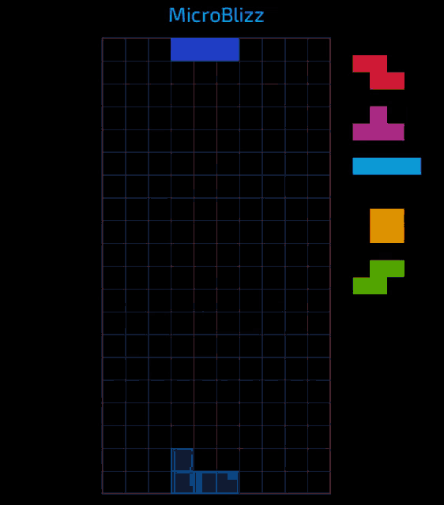

# OldSchoolTetris



<br><br>

## WebSocket Protocol

### Address

```text
wss://<SERVER-ADDRESS>/api/game/ws/:session
```

<br>

### Join

-   Req

```json
{
    "type": "join",
    "userType": "tetris" | "wordguess"
}
```

-   tetris 유저는 wordguess 유저가 들어오면 받음
-   wordguess 유저가 이미 들어와 있으면, 들어옴과 동시에 받음

```json
{
    "type": "join",
    "data": "wordguess user has joined"
}
```

<br>

### Leave

-   나가면 상대 유저에게 전달

```json
{
    "type": "leave",
    "data": "tetris|wordguess user has left"
}
```

<br>

### Verify

-   Req

```json
{
    "type": "verify",
    "word": "단어"
}
```

-   Res

```json
{
    "type": "verify",
    "isCorrect": true | false,
    "description": "설명"
}
```

<br>

### End

-   Req

```json
{
    "type": "end",
    "score": 100
}
```

<br>

### Relay

-   Req

```json
{
    "type": "위 제외 아무거나",
    "data": 아무 데이터
}
```
